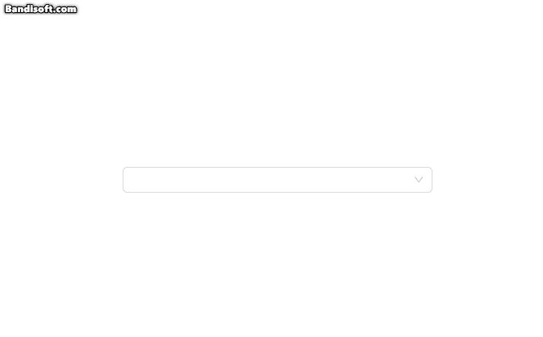

# TagSelect

这是一个基于 `antd` 的 `<Select />` 和 `<Tag />` 封装的选项样式为标签的选择器组件。

下图为该组件的展示效果。



## Option 的属性介绍

| 属性名    | 说明                      | 类型             | 默认值 |
|-----------|---------------------------|------------------|--------|
| label     | 选项内容                  | string           | -      |
| value     | 选项值                    | string \| number | -      |
| tag       | 对应 <Tag/> 的 color 属性 | boolean          | false  |
| disabled  | 是否禁用                  | boolean          | false  |
| className | Option 器类名             | string           | -      |
| style     | Option 器样式             | string           | -      |

## 安装和启动此项目
```bash
# 进入项目后安装依赖
npm install
# 启动项目
npm run dev
```

## 使用示例

可见 [APP.tsx](./src/App.tsx)

```tsx
import { useState } from 'react'
import TagSelect from './components/TagSelect'

function App() {
  const [value, setValue] = useState('1')

  return (
    <div style={{ paddingLeft: '40vw' }}>
      <TagSelect
        style={{ width: '20vw', textAlign: 'left' }}
        value={value}
        onChange={(value) => setValue(value as string)}
        options={[
          { label: 'success', value: '1', tag: 'success' },
          { label: 'processing', value: '2', tag: 'processing' },
          { label: 'error', value: '3', tag: 'error' },
          { label: 'warning', value: '4', tag: 'warning' },
          { label: 'default', value: '5', tag: 'default' },
        ]}
      />
    </div>
  )
}

export default App
```